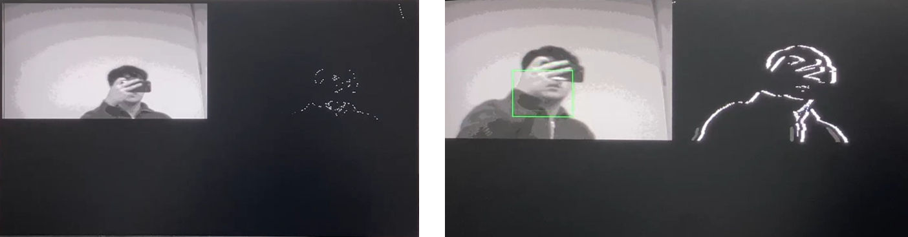
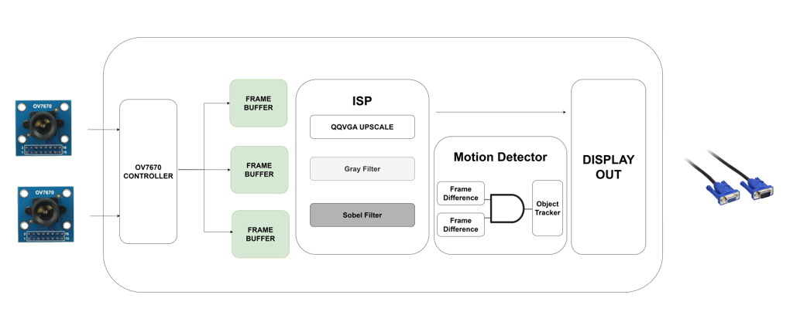

# OV7670-Based Object Tracking System

## Overview
The OV7670-Based Object Tracking System is a real-time object tracking implementation using FPGA technology. This system captures video from an OV7670 camera module, processes the frames to detect motion, and displays the results with tracking indicators on a VGA monitor.

The project was developed using Vivado 2020.2 and targets the BASYS-3 FPGA board.

## Features

### Image Capture
- Captures QVGA (320x240) frames from the OV7670 camera in RGB555 format.
- Configures the camera module via SCCB (I2C-like) protocol.
- Supports multiple frame buffering for motion detection.

### Image Processing
- Converts RGB images to grayscale format for efficient processing.
- Implements 5x5 Sobel edge detection for enhancing object boundaries.
- Performs frame-to-frame differencing to detect motion.
- Applies thresholding for noise reduction and sensitivity control.

### VGA Display
- Outputs processed data to standard VGA monitor (640x480 @ 60Hz).
- Provides split-screen view with quadrant-based layout:
  - Real-time camera feed (grayscale)
  - Motion detection visualization
  - Additional display areas for future enhancements

### Object Tracking
- Detects moving objects through consecutive frame analysis.
- Draws bounding boxes around detected motion.
- Includes adjustable detection sensitivity via threshold controls.
- Provides motion status via LED indicators and output signals.

## Block Diagram

## Dependencies

### Hardware
- BASYS-3 FPGA Board (or compatible Xilinx FPGA).
- OV7670 Camera Module (without FIFO).
- VGA Monitor and cable.

### Tools
- Vivado 2020.2 (or compatible version).

### IP Cores
- `clk_wiz_0`: Clock Wizard for generating multiple clock domains.

### Custom Modules
**Note**: These custom modules are part of the project and must be included in the Vivado project.
- `vga_controller.sv`
- `ov7670_controller.sv`
- `OV7670_SCCB.sv`
- `frameBuffer_4bit.sv`
- `rgb2gray.sv`
- `sobel_filter_5x5.sv`
- `diff_detector_pixel.sv`
- `diff_pixel_counter.sv`
- `object_tracker.sv`
- `RGB_out.sv`
- `frame_counter.sv`

## Project Details

- **Created Date**: March 20, 2025
- **Engineer**: T.Y Jang
- **Target Device**: BASYS-3
- **Tool Version**: Vivado 2020.2
- **Revision**: 0.01

## License

This project is licensed under the MIT License - see the `LICENSE` file for details.
